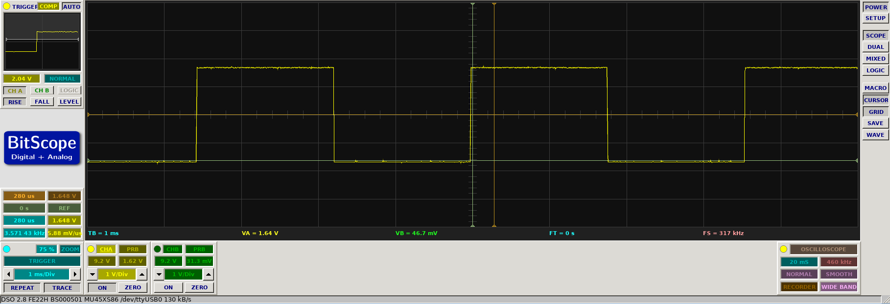

# About

To build, just type `make`.

# Running

Here's a nice test:

**NOTE:** Must be run as root to access the PWM gpio pins currently.
I think the others should work without root but need to update the
code to allow it.
```
$ sudo ./gpiotest 18 -m pwm --cycle 100 --rf 100 --duty 50 --auto
```

If you have a scope you should see something like:

